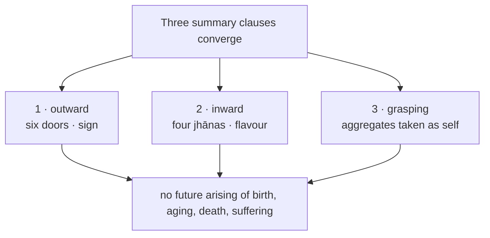

## Plan: MN 138 Uddesavibhaṅga Sutta — discourse diagram

**Status — implemented.** Target file: `src/assets/content-images/mn138.svg`. Single-file build. Auto-discovered by filename — no MDX or content changes needed.

**Source plan:** Built from `/Users/sid/.cursor/plans/mn138_diagram_964a62cc.plan.md`. The earlier draft in this file (narrative frame, heartwood-tree simile, `mn138-heartwood-tree` icon) was superseded and is documented below under *What changed from v1*.

---

### Premise

Mahākaccāna answers all three clauses of the Buddha's summary with **one identical formula**, applied to three arenas:

```
X-anusāri viññāṇaṁ  →  X-assādagadhitaṁ  →  X-assādavinibandhaṁ  →  X-assādasaṁyojanasaṁyuttaṁ
consciousness runs after → glued by relishing → tethered by relishing → yoked and fettered by relishing
```

Insert `na` before each term and the same arena becomes freedom. The diagram's spine is that four-link chain, instantiated three times — once per summary clause — not the heartwood-tree simile.



---

### What changed from v1 (original `.plan` draft)

| v1 (original plan) | Final |
|----|----|
| Narrative opening: Buddha departs, bhikkhus consult Mahākaccāna | No narrative frame — diagram opens on the summary |
| Heartwood-tree simile as a dedicated card | Omitted entirely (not central to the premise) |
| New icon `mn138-heartwood-tree` (from AN 7.65 tree geometry) | Deleted; two new icons instead: `consciousness-following`, `consciousness-unbound` |
| Three loosely-related panels | One repeating four-link mechanism across three arenas |
| `body-observer` for touch door | `sensed` (same as other MN diagrams) |

---

### What changed from the cursor plan draft

| Cursor plan draft | Final build |
|----|----|
| Standalone `mechanism` band between summary and arenas | Removed — four links appear inline in each arena's split panels |
| `consciousness-following` / `consciousness-unbound` icons anchor mechanism band | Icons authored in design system and embedded in `defs` (`i-following`, `i-unbound`) but not placed in the diagram body |
| `viewBox="0 0 920 2530"` | `viewBox="0 0 920 2290"` |
| Header subtitle crediting Mahākaccāna + `uddesa · vibhaṅga` | Header is title + English subtitle only |
| Summary as single full-width keystone card | Three numbered clause cards converging to a shared fruit card |
| Summary lead-in: *"A bhikkhu should examine in such a way that, as he examines —"* | *"Examine in such a way that consciousness is —"* · `yathā yathā upaparikkhato … viññāṇaṁ` |
| Mechanism caption about "same four links" / `na` gate band | Mechanism conveyed per-arena; no global caption band |
| All six sense doors equal weight | Eye / sight (`cakkhu · rūpa`) highlighted in gold; other five dimmed |
| Four-mode self-view grid before aggregate row | Five aggregate chips first; **Form** highlighted; four modes shown for form only, with footnote for other aggregates |
| Hairline note under left grasping panel for `upādā` / `anupādā` textual variant | Omitted in final (panel still uses `upādā paritassanā` per emended reading) |
| Jhāna caution line: *"The jhānas are not the fault…"* | Tier subtitle carries first-jhāna Pali hook instead |

---

### Final output target

| Property | Value |
|----------|-------|
| File | `src/assets/content-images/mn138.svg` |
| Dimensions | `viewBox="0 0 920 2290"` |
| Background | `bg` gradient: `#0b1528 → #0e1a30 → #101e36` |
| Ambient ellipses | Burgundy at upper-left (`cx=230 cy=640`), teal at upper-right (`cx=690 cy=640`), gold at lower (`cx=460 cy=2120`) |
| Build | Single file, no merge script |
| Font | `Georgia, 'Times New Roman', serif` throughout |
| Transform discipline | Every top-level section in a named `<g id="…" transform="translate(…)">` |
| Pali | Direct Unicode in text nodes; no numeric character references |

---

### Reference templates

| Pattern | Source SVG |
|---------|-----------|
| Split panel: left burgundy / right teal | `sn36.6.svg` — left `x=40 w=408`, right `x=472 w=408`, divider at `x=460` |
| Six-column sense-base icons, same x-positions | `mn18.svg`, `mn148.svg` |
| Jhāna ladder rows with graduated fills | `mn19.svg`, `mn77.svg` |
| Dense long-form layout | `mn95.svg` |
| Arrival card + footer lotus | `mn18.svg` |

---

### Section layout (final y-offsets)

```xml
<g id="header"    transform="translate(0, 0)">      <!-- ≈100px -->
<g id="summary"   transform="translate(0, 100)">    <!-- ≈340px -->
<g id="outward"   transform="translate(0, 440)">    <!-- ≈448px -->
<g id="inward"    transform="translate(0, 888)">    <!-- ≈526px -->
<g id="grasping"  transform="translate(0, 1414)"> <!-- ≈596px -->
<g id="arrival"   transform="translate(0, 2010)">  <!-- ≈230px -->
<g id="footer"    transform="translate(0, 2240)">   <!-- ≈50px  -->
```

---

### Phase 1 — Header

- Title: `MN 138 — UDDESAVIBHAṄGA SUTTA` — 22px bold `#c8a040`, letter-spacing 2.7
- Subtitle: `The Exposition of a Summary` — 15px italic `#90a0b8`
- Rule at y≈86
- No narrative frame, no Mahākaccāna credit line, no `uddesa · vibhaṅga` tag

---

### Phase 2 — Summary (three clauses → fruit)

Tier gradient rule, then `discernment-lens` icon with lead-in:

- EN: *"Examine in such a way that consciousness is —"*
- PL: `yathā yathā upaparikkhato … viññāṇaṁ`

Three numbered clause cards (badges 1/2/3 reused on arena tier labels below):

| # | English | Pali |
|---|---------|------|
| 1 | unscattered and undispersed externally | `bahiddhā … avikkhittaṁ avisaṭaṁ` |
| 2 | not fixated internally | `ajjhattaṁ asaṇṭhitaṁ` |
| 3 | unperturbed by not grasping | `anupādāya na paritasseyya` |

Convergence lines from each card to a central node, then fruit card:

- EN: *Then there is: no future arising of birth, old age, death, and suffering*
- PL: `āyatiṁ jātijarāmaraṇadukkhasamudayasambhavo na hotī`

---

### Phase 3 — Arena 1: outward (clause 1)

Tier label: `1 · CONSCIOUSNESS: UNSCATTERED AND UNDISPERSED EXTERNALLY` · `bahiddhā viññāṇaṁ avikkhittaṁ avisaṭaṁ · cakkhunā rūpaṁ disvā`

Six sense doors in a row — **eye / sight** active (gold stroke), others dimmed:

`cakkhu · rūpa` · `sota · sadda` · `ghāna · gandha` · `jivhā · rasa` · `kāya · phoṭṭhabba` · `mano · dhamma`

Split contrast (`tangle-unwise-attention` / `wise-attention`):

| Left — scattered | Right — unscattered |
|---|---|
| `rūpanimittānusāri viññāṇaṁ` → …gadhitaṁ → …vinibandhaṁ → …saṁyojanasaṁyuttaṁ | Each link prefixed with `na` |
| `bahiddhā viññāṇaṁ vikkhittaṁ visaṭanti vuccati` | `bahiddhā viññāṇaṁ avikkhittaṁ avisaṭanti vuccati` |

The sight is still seen on both sides; only the following differs.

---

### Phase 4 — Arena 2: inward (clause 2)

Tier label: `2 · CONSCIOUSNESS: NOT FIXATED INTERNALLY` · `ajjhattaṁ cittaṁ asaṇṭhitaṁ · vivekajapītisukhānusāri viññāṇaṁ`

Four stacked jhāna rows (`stg1`–`stg4` gradients), each with icon and flavour hook:

| Row | Icon | Flavour hook |
|---|---|---|
| First jhāna | `jhana-first` | `vivekajapītisukhānusāri viññāṇaṁ` |
| Second jhāna | `jhana-second` | `samādhijapītisukhānusāri viññāṇaṁ` |
| Third jhāna | `jhana-third` | `upekkhānusāri viññāṇaṁ` |
| Fourth jhāna | `jhana-fourth` | `adukkhamasukhānusāri viññāṇaṁ` |

Each row: right-aligned two-state pill — `saṇṭhitaṁ` (burgundy) / `na … asaṇṭhitaṁ` (teal).

Closing teal card: *"When consciousness does not run after that flavour… the mind is not fixated internally."* · `ajjhattaṁ cittaṁ asaṇṭhitanti vuccati`

---

### Phase 5 — Arena 3: grasping (clause 3)

Tier label: `3 · BY NOT GRASPING, ONE IS UNPERTURBED` · `anupādā aparitassanā · rūpaṁ attato samanupassati`

**Self-view card** (`four-clinging` icon):

1. Five aggregate chips — **Form** (`rūpa`) highlighted in gold; others dimmed
2. `FOUR MODES OF SELF-VIEW` title below aggregate row
3. Four modes for form: `rūpaṁ attato samanupassati` · `rūpavantaṁ vā attānaṁ` · `attani vā rūpaṁ` · `rūpasmiṁ vā attānaṁ`
4. Footnote: *the same would apply for feeling, perception, intentional constructs, and consciousness*

**Change line** (`impermanence-dissolve` icon): *That form then changes and becomes otherwise* · `taṁ rūpaṁ vipariṇamati, aññathā hoti`

Split contrast (`puthujjana-header` / `ariya-header`):

| Left — `upādā paritassanā` | Right — `anupādā aparitassanā` |
|---|---|
| `rūpavipariṇāmānuparivatti viññāṇaṁ` | `na ca rūpavipariṇāmānuparivatti viññāṇaṁ` |
| perturbation overwhelms the mind | mind is not overwhelmed |
| `uttāsavā · vighātavā · apekkhavā` | `na cevuttāsavā · na ca vighātavā · na ca apekkhavā` |

---

### Phase 6 — Arrival

`libGlow` radial behind gold card:

- One-line restatement: `avikkhittaṁ avisaṭaṁ · asaṇṭhitaṁ · aparitassa`
- **No future arising of birth, old age, death, and suffering** · `āyatiṁ jātijarāmaraṇadukkhasamudayasambhavo na hotī`
- `liberation-sparkle` flanking (no `cessation-vessel` in final)

---

### Phase 7 — Footer

Rule `x=300→620`, link to `https://wordsofthebuddha.org/mn138`, lotus motif at `translate(460, 36) scale(.25)` — from `mn18.svg`.

---

### Icons

Embedded as `<symbol id="i-…" viewBox="0 0 24 24">` in `defs`, placed with `<use href>`.

**Placed in diagram (17):** `discernment-lens`, `seen`, `heard`, `sense-nose`, `sense-tongue`, `sensed`, `cognized`, `tangle-unwise-attention`, `wise-attention`, `jhana-first`–`jhana-fourth`, `four-clinging`, `impermanence-dissolve`, `puthujjana-header`, `ariya-header`, `liberation-sparkle`

**In `defs` / manifest but not placed:** `broken-chain`, `non-belonging-scatter`, `cessation-vessel`, `consciousness-following`, `consciousness-unbound` — the last two are new design-system assets; mechanism is conveyed through split-panel text instead.

| New ID | Role |
|--------|------|
| `consciousness-following` | Burgundy orb trailing a receding object on a taut tether — `anusāri viññāṇaṁ` |
| `consciousness-unbound` | Teal orb held steady, slack tether — `na anusāri viññāṇaṁ` |

**Deleted:** `mn138-heartwood-tree.svg` (never shipped)

**Manifest:** `"mn138"` appended to `discourse` arrays of reused icons (including those not placed); two new entries added in `src/utils/buildIconsManifest.ts`. Regenerate with `npm run gen:icons-manifest` and `npm run gen:icons-index`.

---

### Pali fidelity rules

- Every Pali string copied verbatim from `src/content/pli/mn/mn138.md`, direct Unicode, no escapes.
- Summary fruit and arrival both use `…na hotī` (not `hoti`).
- Arena 3 left panel uses emended `upādā paritassanā` (per MDX commentary `[2]`); right panel uses `anupādā aparitassanā`.
- English negative branch retains editorial label *perturbation due to grasping*; Pali source wording is not silently altered.

---

### Verification

1. Diagram opens on the summary — no Buddha-departs card, no bhikkhus, no tree anywhere.
2. Four-link formula is legible in each arena's split panels; clause badges 1/2/3 match summary cards.
3. Every Pali string grep-matches `src/content/pli/mn/mn138.md`; no numeric character references.
4. Jhāna section reads as one row per jhāna with a two-state pill.
5. Arena 3 shows Form active with four self-view modes; other aggregates dimmed with footnote.
6. `npm run gen:icons-manifest` and `npm run gen:icons-index` succeed; `/design-system` lists both new icons under discourse `mn138`.
7. Inspect `/mn138?viz=1` for legibility, flow, contrast, no clipping.
8. `src/assets/content-images/mn138.svg.bk` deleted (note: `public/content-images/mn138.svg.bk` may still exist from an earlier copy).

---

### Decisions

- **No narrative frame** — Buddha's departure, bhikkhus' request, and final approval are not illustrated.
- **No heartwood tree** — the simile is not central to the diagram's premise.
- **No standalone mechanism band** — the four links are shown per-arena to keep the diagram shorter and avoid redundant global caption.
- **No MDX, frontmatter, or interactive-SVG changes** — auto-discovery by filename only.
- **Two new icons** (`consciousness-following`, `consciousness-unbound`) for the design-system catalog; mechanism is conveyed through split-panel text rather than placing these icons in the diagram body.
