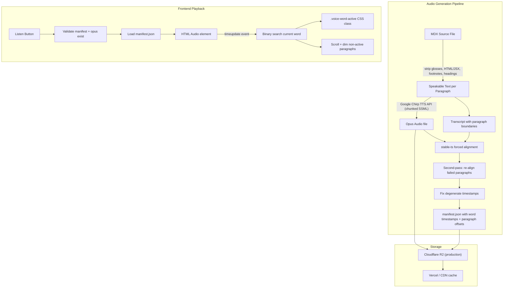

# Voice Mode: TTS Read-Aloud for Sutta Discourses

## Summary

Text-to-speech "voice mode" for English sutta discourses with word-level highlighting and an immersive reading experience. Uses Google Chirp TTS (Charon Male voice) for audio generation and Whisper-based forced alignment (stable-ts) for word-level timestamps.

---

## Technical Feasibility: Confirmed

Two-step pipeline separates audio quality from alignment:

1. **Synthesize** with Google Chirp TTS (SSML with `<p>`, `<s>`, `<break>` tags). Chirp HD does not support `<mark>` elements, so native timepoints are unavailable.
2. **Align** with [stable-ts](https://github.com/jianfch/stable-ts) forced alignment against the exact transcript to get word-level timestamps. Clean TTS audio = ideal alignment conditions.
3. **Second-pass alignment** for failed segments: extract audio slice per paragraph, re-align individually, replace if improved.

---

## Architecture



---

## Phase 0: PoC — COMPLETED

Target discourses: `dhp1-20` (20 short verses), `mn37` (26 prose paragraphs), `mn10` (113 paragraphs, 35 min).

### 0a. Generation Script (`scripts/generate_voice.py`) — DONE

1. Read a discourse MDX file, strip frontmatter.
2. Split into paragraphs (by `#### N` headings for DHP, or by blank-line-separated blocks for prose).
3. Text normalization pipeline:
   - Strip `<collapse>...</collapse>` blocks entirely (collapsed UI text not spoken)
   - Strip remaining HTML/JSX tags (`<Image />`, etc.)
   - Strip glosses: `|visible::tooltip|` → `visible`
   - Strip inline markdown (bold, italic, links)
   - Strip superscript footnote markers (`^[1]^`)
   - Replace em-dashes `—` with `, ` for natural TTS pausing
   - Collapse whitespace
4. SSML construction with sentence splitting:
   - Primary boundaries: `.` `!` `?` `;` (also after closing quotes: `';'` `."`)
   - Fallback for long segments: commas
   - Each sentence wrapped in `<s>` tags, paragraphs in `<p>` tags
   - **Dynamic paragraph breaks**: verse text and quote-starting paragraphs get `TTS_PARAGRAPH_BREAK_MS` (default 1200ms); continuing prose gets `TTS_CONSECUTIVE_PARAGRAPH_BREAK_MS` (default 800ms)
   - Verse detection: port of `contentParser.ts` `isVerse()` — multi-line text with structured line endings
   - Quote detection: paragraph starts with `"`, `'`, or Unicode quotation marks
5. **Chunked synthesis** for long discourses exceeding Google's 5000-byte SSML limit: paragraphs grouped into ≤4800-byte SSML chunks → WAV → concatenate → ffmpeg → Opus (32kbps VBR). **Parallel synthesis** via thread pool (up to 4 concurrent TTS API calls) for IO-bound speedup.
6. **Forced alignment** with `stable-ts` (`model.align()`, `fast_mode=True`)
7. **Second-pass alignment** for failed paragraphs (≥40% degenerate words): extract audio slice → re-align → replace if improved
8. **Fix degenerate timestamps**: detect anomalous words (zero-duration or single word eating >5× average), redistribute evenly across available time
9. Output: `public/audio/<slug>.opus` + `public/audio/<slug>.manifest.json`

### Configuration

Script reads from `.env` file (or env vars):

```
GOOGLE_APPLICATION_CREDENTIALS=path/to/service-account.json
TTS_VOICE=en-US-Chirp3-HD-Charon
TTS_LANGUAGE_CODE=en-US
WHISPER_MODEL=base
TTS_PARAGRAPH_BREAK_MS=1200
TTS_CONSECUTIVE_PARAGRAPH_BREAK_MS=800
```

### Manifest Format

```json
{
  "version": 1,
  "textHash": "sha256 of normalized speakable text",
  "voice": "en-US-Chirp3-HD-Charon",
  "generatedAt": "2026-04-09T00:00:00Z",
  "duration": 142.5,
  "paragraphs": [
    {
      "id": 1,
      "start": 0.0,
      "end": 12.3,
      "words": [
        { "w": "Mind", "s": 0.0, "e": 0.35 },
        { "w": "precedes", "s": 0.36, "e": 0.82 }
      ]
    }
  ]
}
```

### 0b. Frontend Player — DONE

**Entering voice mode:**
- Listen button (speaker-wave SVG) in toolbar. Only shown when **both** manifest.json and .opus exist and manifest is valid (has `version` + non-empty `paragraphs`).
- Clicking Listen → auto-starts playback, sets `?voice=1` in URL.
- `?voice=1` on page load → opens voice mode but does NOT auto-play (focuses play button).
- `V` key toggles voice mode. `Space` toggles play/pause. `Escape` exits.
- If assets missing, `?voice=1` is silently stripped from URL.

**Voice controls (fixed bottom bar):**

```
Row 1:  [◀◀]  [▶ Play]  [▶▶]  ═══════════  0:49 / 3:13  ¶ 6/20
Row 2:  [0.75×] [1×] [1.25×] [1.5×]  [Focus: On]          [×]
```

**Per-paragraph play buttons:**
- Two buttons per paragraph (absolutely positioned at top-left, inside `<p>`):
  - Play-pause icon: play this paragraph only (auto-pause at paragraph end)
  - Play icon: play continuously from here
- Subtle opacity by default, brighter on hover / when active
- Does not break split-mode vertical alignment (no extra DOM siblings)

**Word highlighting:**
- `<sup>` elements (footnote refs like `^[1]^`) are marked `.voice-skip` and excluded from word wrapping
- Multi-word glosses split into individual voice-word spans
- Punctuation-only spans merged into adjacent words
- Em-dashes treated as word boundaries in both DOM and manifest
- Binary search (bisect on start times) for both paragraph and word lookup — robust against degenerate alignment

**Focus/scroll behavior:**
- Focus: On → immersive mode after 10s of playback; dims non-active content to 18% opacity
- Focus: On + user scrolls → Focus automatically turns Off, immersive removed
- Focus: Off + user scrolls → auto-scroll pauses
- User scrolls back to active paragraph → auto-scroll resumes
- Toggling Focus (either direction) → resets scroll, snaps to current paragraph
- Play / seek / prev / next → resets scroll state

**Layout switch handling:**
- Detects `layoutChanged` event (interleaved ↔ split)
- Re-discovers visible article, re-wraps words, re-injects buttons

**localStorage:** Persists position, paragraph, speed per discourse.

---

## Phase 1: Production Storage — IN PROGRESS

### 1a. Cloudflare R2 Storage

**Bucket:** `dhamma-audio` (Account ID: `218281ccd6ba725b066b69f9dffb442b`)
**Custom domain:** `hear.wordsofthebuddha.org` (Active, TLS 1.3)

**What gets stored:** Both `.opus` audio and `.manifest.json` at the **bucket root** (e.g. `mn10.opus`, `mn10.manifest.json`) so public URLs are `https://hear.wordsofthebuddha.org/mn10.opus` with no `/audio/` segment.

**Sync script:** `scripts/sync_audio_r2.py`
- `push` — upload local `public/audio/` → R2 bucket root (with cache headers)
- `pull` — download R2 → local `public/audio/`
- Supports per-slug filtering
- Cache headers: `.opus` files get `max-age=31536000, immutable`; manifests get `max-age=3600, stale-while-revalidate=86400`

**Git:** Audio files (`.opus`, `.manifest.json`) are now `.gitignore`d. Only the sync script and generation script are versioned.

**Env vars:**
```
R2_ACCOUNT_ID=218281ccd6ba725b066b69f9dffb442b
R2_ACCESS_KEY_ID=<from token creation>
R2_SECRET_ACCESS_KEY=<from token creation>
R2_BUCKET=dhamma-audio
```

### 1b. Production Serving

**Dev:** `pull` from R2 into `public/audio/`, Astro serves them at `/audio/<slug>.opus` (no `PUBLIC_AUDIO_BASE_URL`).

**Prod (Vercel):** Set `PUBLIC_AUDIO_BASE_URL=https://hear.wordsofthebuddha.org` (no trailing slash). Client fetches `https://hear.wordsofthebuddha.org/<slug>.opus` and `<slug>.manifest.json`. Zero Vercel bandwidth cost. Cloudflare edge caching + unlimited free egress.

**Client caching:** Opus files are immutable (content-addressed via textHash) with 1-year cache. Manifests have 1-hour cache with stale-while-revalidate for freshness. Cloudflare edge caches both globally. Browser caches locally after first download.

### 1c. Paragraph-Level Audio Patching

**Feasibility: Possible but with trade-offs.**

The approach for re-doing specific paragraphs (e.g., P14 in MN 10):

```
1. Identify paragraph time range from manifest (e.g., P14: 52.3s–58.7s)
2. Synthesize replacement WAV for just that paragraph's text
3. ffmpeg: extract prefix (0–52.3s) + new paragraph WAV + extract suffix (58.7s–end)
4. Concatenate → re-encode to Opus
5. Re-run full alignment (timestamps shift for everything after the patch)
```

**Pros:**
- Only 1 TTS API call instead of 9 chunks
- Faster iteration for fixing specific issues
- Saves cost when only one paragraph text changed

**Drawbacks:**
- **Audible seams:** Voice timbre, pitch, and room tone can differ slightly between TTS calls, even with the same voice. The inter-paragraph pause (1.2s silence) largely masks this, but mid-sentence patches would be noticeable.
- **Timestamp cascade:** Everything after the patch shifts in time. Full re-alignment is needed anyway.
- **Complexity:** Must track original chunk boundaries, pause durations, sample-rate matching. Easy to introduce subtle bugs.
- **When it doesn't help:** If the text normalization changed (e.g., stripping `<collapse>` blocks), the paragraph count itself changes — full regen is the only safe path.

**Recommendation:** Use paragraph patching for:
- **Pronunciation fixes** (same text, different SSML hints)
- **Single-paragraph text edits** in an otherwise stable discourse

Use full regeneration for:
- **Pipeline/normalization changes** (sentence splitting, tag stripping, etc.)
- **Multiple paragraphs affected**
- **New discourse versions**

A `--patch-paragraphs 14,15` flag could be added to `generate_voice.py` in Phase 1.1 if the need proves frequent.

---

## Phase 2: Future Enhancements

- Sleep timer
- Background/lock-screen playback via Media Session API
- Download for offline listening
- Playback queue (multiple discourses)
- Analytics on listening patterns
- Alternative voices / user voice preference
- Pali pronunciation mode (TTS for Pali paragraphs)

---

## Key Risks and Mitigations

| Risk | Mitigation |
|------|-----------|
| Alignment quality on very short paragraphs (2 words) | TTS audio is clean = ideal alignment. Second-pass retries failed segments on isolated clips. Degenerate timestamp fixer as final safety net. |
| Word wrapping breaks tooltip/gloss functionality | Tooltip spans split into individual voice-word spans with class preservation. Superscript footnotes excluded. |
| Content changes invalidate audio | `textHash` check in manifest; regeneration per discourse is fast. |
| Chirp voice quality or pronunciation of Pali terms | SSML `<phoneme>` can be added. Paragraph patching allows targeted fixes. |
| Long discourses exceed SSML limits | Chunked synthesis (≤4800 bytes per chunk). Sentence splitting handles quoted semicolons, commas as fallback. |
| `<collapse>` blocks cause audio-text drift | Entire collapse regions stripped from TTS text. |
| CSS specificity hides/shows Listen button incorrectly | `.voice-mode-trigger.hidden { display: none !important }` ensures Tailwind `hidden` class wins over component styles. |

---

## Feedback Log

- **2026-04-08:** Initial plan. PoC scope (dhp1-20), manifest format, forced alignment, Chirp Charon Male, Opus, R2.
- **2026-04-09 (round 1):** Generation script done. Tested dhp1-20 (193s, 20 paragraphs). Service account gitignored; cache under `.cache/`.
- **2026-04-09 (round 2):** CLI multi-target support. Prose MDX fallback. Phase 0b frontend: VoiceMode.astro, voiceModeClient.ts, voice-mode.css. Listen button, bottom bar, word highlights, immersive mode, localStorage resume.
- **2026-04-09 (round 3):** Gloss word sync, auto-scroll, voice bar redesign, speaker-wave icon, focus toggle, click-to-play paragraph, mn37 chunked synthesis, 1500ms→1200ms pause.
- **2026-04-09 (round 4):** Punctuation merging, keyboard shortcuts (V/Space/Escape), auto-start on Listen click, `?voice=1` URL management, per-paragraph play buttons (single + continuous), close icon, `?viz` mutual exclusion.
- **2026-04-09 (round 5):** Em-dash as word boundary (DOM + generation), play icons repositioned above paragraphs, user scroll detection, cleaner single-para stop, seek slider paragraph update.
- **2026-04-09 (round 6):** Bisect-based word/paragraph lookup (fixes stuck highlight from degenerate alignment). Improved `_fix_degenerate_word_times` (handles mid-paragraph failures). Split-mode play icons via layout detection. Focus/scroll: auto-disable on scroll, resume when scrolled back.
- **2026-04-09 (round 7):** `<collapse>` block stripping (was causing audio-text drift in MN 10). SSML sentence splitting enhanced for `';'` patterns. Second-pass alignment for failed segments. mn10 tested (113 paragraphs, ~35 min). CSS specificity fix for Listen button visibility. Listen button gated on manifest + opus HEAD check. Superscript footnote stripping (`^[1]^`). `<sup>` excluded from DOM word wrapping.
- **2026-04-09 (round 8):** Phase 1 started. R2 bucket created (`dhamma-audio`). Audio files gitignored. `sync_audio_r2.py` push/pull script. Plan updated with R2 serving strategy, paragraph patching analysis, production architecture.
- **2026-04-09 (round 9):** Dynamic paragraph breaks: 1200ms for verse/quoted paragraphs, 800ms for continuing prose. Detection via `_is_verse()` (port of `contentParser.ts`) and `_starts_with_quote()`. Parallel TTS chunk synthesis via thread pool (up to 4 workers). R2 custom domain `hear.wordsofthebuddha.org` configured and verified. All existing audio synced to R2 with cache headers. Superscript footnote stripping confirmed working.
- **2026-04-09 (round 10):** R2 objects at bucket root (no `audio/` prefix). Client uses `PUBLIC_AUDIO_BASE_URL` (origin only) so URLs are `https://hear.wordsofthebuddha.org/<slug>.opus`. `generate_audio_status.py` R2 scan updated. Slug filters for push/pull fixed so `mn1` does not match `mn10`.
